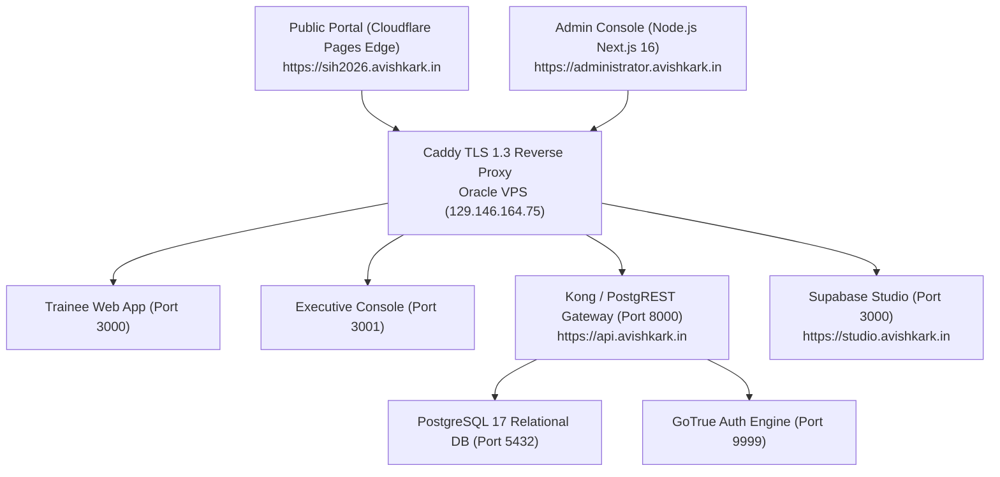

# 📋 PRODUCT REQUIREMENTS DOCUMENT (PRD)

## Project Name: MahaSkill Track (Nexus)
**Problem Statement PS-135:** Privacy-Preserving, Longitudinal Skilling-Outcomes and Vocational Impact-Measurement System  
**Client / Beneficiary:** Government of Maharashtra (Skill Development, Employment and Entrepreneurship Department)  
**Hackathon Target:** Smart India Hackathon (SIH 2026) — National Finals  
**Version:** 2.0.0 (Production Release)  
**Classification:** Restricted Government Enterprise Blueprint  

---

## 1. Executive Summary & Problem Context
India trains over 10 million youth annually across PMKVY, DDU-GKY, ITIs, and State Vocational Societies (MSSDS). However, **90% of state skill missions suffer from longitudinal attrition blindness**:
- They lose contact with candidates 3–6 months post-training.
- They cannot verify whether self-employed candidates are operating legitimate businesses or have ceased operations.
- They lack real-time visibility into wage progression trajectories, wage stagnation, and regional skill deficits.
- Exposing trainee income and identity creates serious personal data and privacy violations.

**MahaSkill Track** solves this with a **Zero-Knowledge, Longitudinal Outcome & MSME Verification Platform**:
1. **Zero-PII Privacy Enclaves:** SHA-256 privacy hashes decouple research datasets from candidate identity.
2. **Automated Multi-Channel Survey Cadence:** 3M, 6M, 12M, 18M, and 24M check-ins over WhatsApp, SMS, and Portal.
3. **Udyam MSME & Banking Verification Engine:** Validates enterprise registration, turnover run-rates, and Mudra/PMEGP capital subsidies.
4. **District Labor Market Deficit Intelligence:** Visualizes candidate supply vs industry demand across Maharashtra's 36 districts.

---

## 2. Target User Personas & Workflows

### Persona 1: Vocational Trainee (Priya Sharma)
- **Role:** Certified Candidate & Micro-Entrepreneur (Boutique Tailoring, Pune).
- **Core Needs:**
  - View verified NSQF Level-4 Certificate with anti-counterfeiting QR code.
  - Submit self-employment proofs (Udyam MSME, electricity bills, shop photos).
  - Complete periodic 1-minute career progression check-ins.
  - Access localized vocational resources in Marathi (`मराठी`), Hindi (`हिंदी`), and English.

### Persona 2: District Skill Development Officer (DSDO)
- **Role:** Field Executive for Pune / Nashik / Nagpur District.
- **Core Needs:**
  - Review and inspect pending MSME verification documents.
  - Approve authentic enterprises or reject fraudulent submissions with required feedback notes.
  - Trigger batch WhatsApp survey reminders to overdue milestone cohorts.
  - Track district placement percentage and average salary benchmarks.

### Persona 3: State Mission Director (Superadmin Executive)
- **Role:** State-level policymaker and administrator.
- **Core Needs:**
  - Macro-level overview of state-wide trainee enrollment (25L+ candidates), placement rates, and wage multipliers.
  - Disburse capital grants under government schemes (PMEGP, Mudra, CMSPY).
  - Manage training program catalog and course curriculum standards.
  - Provision sub-administrators and monitor the immutable cryptographic audit log.
  - White-label portal branding and adjust survey reminder cadences.

---

## 3. System Architecture & Tech Stack

| Layer | Selected Technology | Rationale & Standards |
| :--- | :--- | :--- |
| **Frontend Framework** | Next.js 16.3.3 (Turbopack, App Router) | React 19 server/client components, zero hydration overhead, SEO-friendly static export. |
| **Styling & Icons** | Tailwind CSS v4, Lucide React | High-contrast WCAG AAA accessible design, mobile touch-optimized. |
| **Data Visualization** | Recharts (ResponsiveContainer) | Longitudinal wage curve, district placement leaderboards, deficit donuts. |
| **Validation Engine** | Zod 3.x | Strict server-side schema validation on all inputs and API routes. |
| **Backend & DB** | PostgreSQL 17, PostgREST 12, Supabase | Relational schema with B-Tree indexes, foreign keys, RLS policies, and immutable triggers. |
| **Hosting & Infra** | Oracle Cloud Enterprise VPS + Cloudflare | High availability, PM2 process management, automated daily SQL snapshots. |

---

## 4. Core Functional Modules

### Module A: Trainee Workspace & LinkedIn-Inspired Skill Passport
- Universal Authentication: Email or Username login + 6-digit OTP verification + Passwordless Magic Link.
- Profile Management: Education history, passing percentage, dynamic skills tag editor, and photo avatar manager.
- Printable NSQF Certificate: High-DPI canvas with Guilloche pattern, state seal, and public verification QR code.
- Cryptographic Document Vault: Storage for DigiLocker/Aadhaar/Udyam certificates with SHA-256 fingerprint seals.
- Multilingual AI Chatbot: Instant vocational advice and policy guidelines in Marathi, Hindi, and English.

### Module B: Udyam MSME Verification Engine
- Standard Format Validation: `UDYAM-MH-XX-XXXXXXX` and 15-digit GST format checks.
- Verification Queue: Filterable by status (`pending`, `approved`, `rejected`, `all`).
- Document Inspection Modal: High-resolution in-app preview with cryptographic seal and audit watermark.
- Approval/Rejection Pipeline: Atomic status update + automated audit log creation + trainee notification push.

### Module C: Longitudinal Survey & Outcome Tracking
- Milestone Schedulers: 3M, 6M, 12M, 18M, and 24M check-ins.
- Survey Self-Service Modal: Collects current enterprise status, monthly revenue bracket, job satisfaction score (1–5), and skill utilization index (1–5).
- Automated Multi-Channel Dispatch: WhatsApp and SMS API integration with 7-day advance reminder window.
- Wage Trajectory Curve: Interactive chart comparing baseline income vs longitudinal progress.

### Module D: Government Executive Suite & District Intelligence
- State Mission Overview: Real-time telemetry cards (Trainees, Enterprises, Placements, Budget).
- District Deficit Matrix: Supply vs Demand gap analytics for critical trades (EV Technicians, Solar PV, CNC Machining).
- Government Scheme Allocations: Mudra, PMEGP, CMSPY allocation dials and Capital Grant disbursement modal.
- Sub-Admin RBAC Provisioning: Role-based access control for district coordinators.
- White-Label Customization: Live mission theme color palette and state emblem selectors.
- Anonymized Data Export: Zero-PII CSV export for public policy researchers and NITI Aayog reporting.

---

## 5. Security, Zero Trust & Compliance Standards
1. **Zero Client-Side Secret Leakage:** Master keys (`SUPABASE_SERVICE_ROLE_KEY`, `POSTGRES_PASSWORD`) never exposed to browser bundles.
2. **Row-Level Security (RLS):** Enabled on all 16 relational tables with strict `auth.uid()` predicates.
3. **Cryptographic Identity Masking:** Aadhaar numbers stored only in masked format (`XXXX-XXXX-1234`).
4. **Input Sanitization & Schemas:** Zod schemas applied to 100% of mutation payloads.
5. **No Native Blocking Popups:** All user notifications handled via sleek in-app toast alerts.
6. **Mobile Touch Compliance:** All interactive elements $\ge 44\text{px} \times 44\text{px}$.
