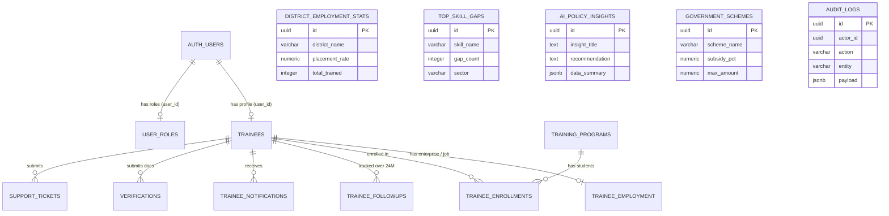

# MahaSkill Track — Supabase Architecture & Production Database Schema

This document provides a comprehensive technical specification of the database architecture, schema definitions, PostgreSQL custom ENUMs, triggers, Row Level Security (RLS) policies, and foreign key relationships powering the **MahaSkill Track** platform (Public Trainee Portal & Executive Administration Console).

A complete, raw PostgreSQL DDL dump is also exported and maintained in [`supabase/schema.sql`](file:///c:/Users/Dell/Desktop/SIH2026/supabase/schema.sql).

---

## 1. Entity-Relationship Diagram (ERD)



---

## 2. PostgreSQL Custom ENUM Types

To ensure strict data integrity and prevent invalid states, the database uses PostgreSQL native enum types:

```sql
CREATE TYPE public.employment_status_type AS ENUM (
    'employed',
    'self_employed',
    'apprenticeship',
    'job_seeking',
    'not_employed'
);

CREATE TYPE public.followup_milestone_type AS ENUM (
    '3_months',
    '6_months',
    '12_months',
    '18_months',
    '24_months'
);

CREATE TYPE public.followup_status_type AS ENUM (
    'scheduled',
    'completed',
    'upcoming',
    'overdue',
    'pending'
);

CREATE TYPE public.user_role_type AS ENUM (
    'superadmin',
    'admin',
    'evaluator',
    'analyst'
);
```

---

## 3. Detailed Data Dictionary (16 Production Tables)

### 3.1 `public.trainees`
Core longitudinal profile of candidates trained under Maharashtra Skill Development Society.
| Column | Type | Constraints / Defaults | Description |
| :--- | :--- | :--- | :--- |
| `id` | `uuid` | `PRIMARY KEY, DEFAULT gen_random_uuid()` | Unique Trainee UUID |
| `user_id` | `uuid` | `REFERENCES auth.users(id) ON DELETE SET NULL` | Supabase Auth UUID |
| `trainee_id` | `varchar(50)` | `UNIQUE, NOT NULL` | State Registration ID (`TRN-XXXXXX`) |
| `username` | `varchar(100)` | `UNIQUE` | User handle |
| `full_name` | `varchar(255)` | `NOT NULL` | Candidate Legal Name |
| `email` | `varchar(255)` | `UNIQUE, NOT NULL` | Email Address |
| `phone` | `varchar(20)` | `NULL` | Contact Number |
| `dob` | `date` | `NULL` | Date of Birth |
| `gender` | `varchar(50)` | `NULL` | Gender Identity |
| `aadhaar_masked` | `varchar(20)` | `NULL` | Privacy-Preserving Masked Aadhaar |
| `address` | `text` | `NULL` | Residential Address |
| `district` | `varchar(100)` | `NOT NULL, DEFAULT 'Maharashtra'` | District Name |
| `state` | `varchar(100)` | `NOT NULL, DEFAULT 'Maharashtra'` | State Name |
| `pincode` | `varchar(10)` | `NULL` | Postal Code |
| `avatar_url` | `text` | `NULL` | S3 / CDN Avatar URL |
| `profile_completion_pct` | `integer` | `DEFAULT 30` | % Completion of profile |
| `is_active` | `boolean` | `DEFAULT true` | Account active state |
| `highest_education` | `varchar(100)` | `NULL` | Academic Background |
| `board_university` | `varchar(255)` | `NULL` | Education Board |
| `year_of_passing` | `integer` | `NULL` | Year of completion |
| `education_percentage` | `numeric(5,2)` | `NULL` | Marks % |
| `skills` | `text[]` | `DEFAULT '{}'` | Array of acquired vocational skills |
| `about_me` | `text` | `NULL` | Bio & Ambition statement |
| `privacy_hash` | `varchar(64)` | `NULL` | SHA-256 PII Integrity Checksum |
| `created_at` | `timestamptz` | `DEFAULT now()` | Creation Timestamp |
| `updated_at` | `timestamptz` | `DEFAULT now()` | Last Update Timestamp |

---

### 3.2 `public.trainee_employment`
Tracks post-training micro-enterprises, shops, freelance setups, and wage employment.
| Column | Type | Constraints / Defaults | Description |
| :--- | :--- | :--- | :--- |
| `id` | `uuid` | `PRIMARY KEY, DEFAULT gen_random_uuid()` | Record UUID |
| `trainee_id` | `uuid` | `REFERENCES trainees(id) ON DELETE CASCADE` | Associated Trainee |
| `status` | `employment_status_type` | `NOT NULL, DEFAULT 'self_employed'` | Employment Category |
| `business_name` | `varchar(255)` | `NULL` | Enterprise / Shop Name |
| `business_type` | `varchar(100)` | `NULL` | Trade or Service Sector |
| `business_category` | `varchar(100)` | `DEFAULT 'Micro-Enterprise'` | Enterprise Size |
| `business_status` | `varchar(50)` | `DEFAULT 'active'` | Operational Status |
| `establishment_date` | `date` | `NULL` | Inception / Registration Date |
| `monthly_revenue` | `numeric(12,2)` | `DEFAULT 0` | Gross Monthly Turnover (₹) |
| `monthly_profit` | `numeric(12,2)` | `DEFAULT 0` | Net Monthly Income (₹) |
| `monthly_income_range` | `varchar(100)` | `NULL` | Bracket representation |
| `udyam_number` | `varchar(50)` | `NULL` | MSME Udyam Registration No |
| `gst_number` | `varchar(50)` | `NULL` | GSTIN (if applicable) |
| `business_address` | `text` | `NULL` | Premise Location |
| `employees_count` | `integer` | `DEFAULT 1` | Direct Jobs Created |
| `verified_by_admin` | `boolean` | `DEFAULT false` | District Officer Verification |
| `created_at` | `timestamptz` | `DEFAULT now()` | Creation Timestamp |
| `updated_at` | `timestamptz` | `DEFAULT now()` | Last Modified |

---

### 3.3 `public.trainee_followups`
Longitudinal outcome milestones conducted at 3, 6, 12, 18, and 24 months post-training.
| Column | Type | Constraints / Defaults | Description |
| :--- | :--- | :--- | :--- |
| `id` | `uuid` | `PRIMARY KEY, DEFAULT gen_random_uuid()` | Survey ID |
| `trainee_id` | `uuid` | `REFERENCES trainees(id) ON DELETE CASCADE` | Trainee Ref |
| `milestone` | `followup_milestone_type` | `NOT NULL` | Longitudinal Interval |
| `due_date` | `date` | `NOT NULL` | Milestone SLA Target Date |
| `completed_date` | `date` | `NULL` | Date Survey Submitted |
| `status` | `followup_status_type` | `NOT NULL, DEFAULT 'scheduled'` | Status (`completed`, `upcoming`, etc.) |
| `current_status` | `varchar(100)` | `NULL` | Status at survey time |
| `current_income_range`| `varchar(100)` | `NULL` | Income tier at milestone |
| `income_growth_pct` | `numeric(5,2)` | `NULL` | Verified wage hike % |
| `job_satisfaction_score`| `integer` | `CHECK (1-5)` | Trainee CSAT Score |
| `skill_utilization_score`| `integer`| `CHECK (1-5)` | Course Skill Match Score |
| `additional_support_needed`| `text` | `NULL` | Credit / Subsidy Requests |
| `survey_channel` | `varchar(50)` | `DEFAULT 'web_portal'` | Submission Source |
| `survey_data_json` | `jsonb` | `DEFAULT '{}'` | Raw Survey Response Payload |
| `remarks` | `text` | `NULL` | Evaluator / Trainee Remarks |
| `created_at` | `timestamptz` | `DEFAULT now()` | Record Timestamp |

---

### 3.4 `public.training_programs`
Catalog of NSQF-aligned skill development courses.
| Column | Type | Description |
| :--- | :--- | :--- |
| `id` | `uuid PK` | Program ID |
| `title` | `varchar(255)` | Course Name (e.g. Advanced Tailoring) |
| `sector` | `varchar(100)` | Industry Sector |
| `duration_months` | `integer` | Course Length in Months |
| `provider_name` | `varchar(255)` | Government ITI or Accredited Training Partner |
| `description` | `text` | Curriculum Details |

---

### 3.5 `public.trainee_enrollments`
Bridges candidates to training courses and issues verifiable NSQF certifications.
| Column | Type | Description |
| :--- | :--- | :--- |
| `id` | `uuid PK` | Enrollment ID |
| `trainee_id` | `uuid FK` | Links to `trainees(id)` |
| `program_id` | `uuid FK` | Links to `training_programs(id)` |
| `enrolled_date` | `date` | Batch Start Date |
| `completed_date` | `date` | Batch End Date |
| `certified_date` | `date` | Certification Date |
| `certificate_id` | `varchar(100)` | Cryptographic Certificate ID |
| `status` | `varchar(50)` | `enrolled`, `completed`, `certified` |
| `grade` | `varchar(10)` | `A+`, `A`, `B`, `Distinction` |

---

### 3.6 `public.verifications`
Document and business proof verification queue for District Officers.
| Column | Type | Description |
| :--- | :--- | :--- |
| `id` | `uuid PK` | Verification Queue Item |
| `trainee_id` | `uuid FK` | Candidate Submitting |
| `document_type` | `varchar(100)` | `udyam`, `aadhaar`, `income_proof`, `trade_license` |
| `document_name` | `varchar(255)` | Filename / Display Label |
| `document_url` | `text` | Secure Storage URL |
| `status` | `varchar(50)` | `pending`, `verified`, `rejected` |
| `admin_notes` | `text` | Evaluator Findings |
| `reviewed_by` | `varchar(255)` | Superadmin / Officer Identifier |
| `reviewed_at` | `timestamptz` | Approval Timestamp |

---

### 3.7 `public.recommended_opportunities`
District-targeted upskilling schemes, MUDRA credit links, and enterprise grants.
| Column | Type | Description |
| :--- | :--- | :--- |
| `id` | `uuid PK` | Scheme ID |
| `title` | `varchar(255)` | Scheme Headline |
| `category` | `varchar(100)` | Grant / Course / Loan |
| `provider` | `varchar(255)` | MSSDS / MSME / Banks |
| `link_url` | `text` | External Application URL |
| `description` | `text` | Eligibility & Subsidy Details |
| `target_skills` | `text[]` | Skill matching tags |
| `is_active` | `boolean` | Display switch |

---

### 3.8 `public.trainee_notifications`
In-app candidate notification system.
| Column | Type | Description |
| :--- | :--- | :--- |
| `id` | `uuid PK` | Notification UUID |
| `trainee_id` | `uuid FK (Nullable)` | Specific trainee or `NULL` for broadcast |
| `title` | `varchar(255)` | Headline |
| `message` | `text` | Alert Body |
| `type` | `varchar(50)` | `info`, `success`, `warning`, `error` |
| `is_read` | `boolean` | Read Status |
| `created_at` | `timestamptz` | Timestamp |

---

### 3.9 `public.user_roles`
Role-Based Access Control (RBAC) mapping for administrative portals.
| Column | Type | Description |
| :--- | :--- | :--- |
| `id` | `uuid PK` | Role Assignment ID |
| `user_id` | `uuid FK` | Links to `auth.users(id)` |
| `email` | `varchar(255)` | Superadmin / Admin Email |
| `username` | `varchar(100)` | User handle (`Avishkar0`) |
| `role` | `user_role_type` | `superadmin`, `admin`, `evaluator` |
| `is_active` | `boolean` | Enable/Disable switch |

---

### 3.10 `public.support_tickets`
Feedback, Grievance, and Helpdesk ticketing for trainees and evaluators.
| Column | Type | Description |
| :--- | :--- | :--- |
| `id` | `uuid PK` | Ticket UUID |
| `trainee_id` | `uuid FK (Nullable)` | Submitter |
| `user_email` | `varchar(255)` | Contact Email |
| `category` | `varchar(100)` | `bug`, `grievance`, `subsidy_help`, `other` |
| `subject` | `varchar(255)` | Issue Summary |
| `message` | `text` | Detailed Description |
| `status` | `varchar(50)` | `open`, `in_review`, `resolved`, `closed` |
| `resolution_notes`| `text` | Officer Action Record |

---

### 3.11 Auxiliary Policy & Governance Tables
- **`district_employment_stats`**: District-by-district skilling KPIs (`placement_rate`, `total_trained`, `micro_enterprises_registered`).
- **`top_skill_gaps`**: Sectoral demand-supply shortfall calculations for state planning.
- **`ai_policy_insights`**: Auto-generated strategic policy briefs with actionable AI insights.
- **`government_schemes`**: Subsidy percentages and maximum sanctioned amounts.
- **`audit_logs`**: Tamper-evident trail of administrative approvals and security events.
- **`promo_codes`**: State incentive codes for sponsored assessment exams.

---

## 4. Row Level Security (RLS) & Triggers

### 4.1 Automatic Timestamps
Every table with `updated_at` utilizes the standard trigger function:
```sql
CREATE OR REPLACE FUNCTION public.handle_updated_at()
RETURNS TRIGGER AS $$
BEGIN
    NEW.updated_at = now();
    RETURN NEW;
END;
$$ LANGUAGE plpgsql;
```

### 4.2 RLS Policies
All tables are protected by Row Level Security policies configured to allow:
1. **Authenticated Users**: Read and update their own trainee records (`auth.uid() = user_id`).
2. **Superadmins & Officers**: Full administrative access across all trainee and audit tables.
3. **Public Catalog Tables**: Permissive read access for training courses and state schemes.

---

## 5. Instructions to Deploy Schema

### Method A: Direct Execution via psql / Docker
```bash
docker exec -i supabase-db psql -U postgres -d postgres < supabase/schema.sql
```

### Method B: Remote VPS Execution
```bash
scp -i <path_to_key> supabase/schema.sql avishkar@<VPS_IP>:~/schema.sql
ssh -i <path_to_key> avishkar@<VPS_IP> "docker exec -i supabase-db psql -U postgres -d postgres < ~/schema.sql"
```

### Method C: Supabase Hosted Cloud
1. Navigate to the **SQL Editor** in your Supabase Dashboard.
2. Paste the contents of [`supabase/schema.sql`](file:///c:/Users/Dell/Desktop/SIH2026/supabase/schema.sql).
3. Click **RUN**.
